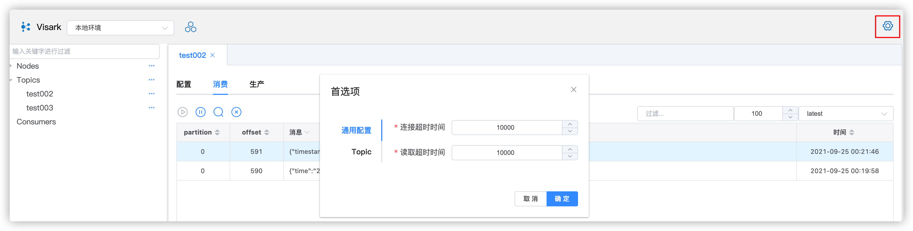
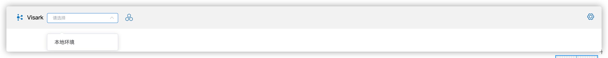
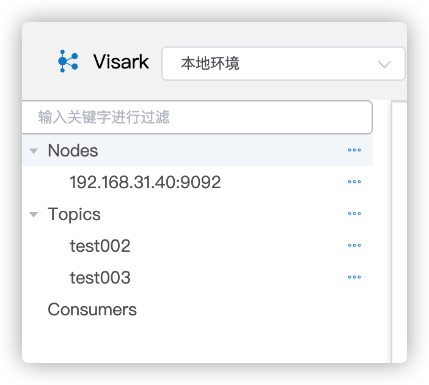
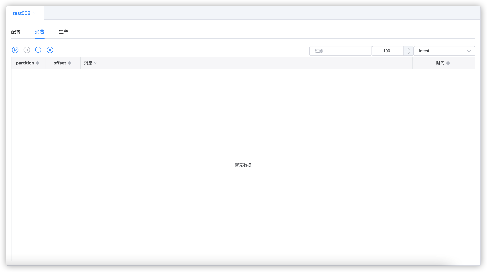
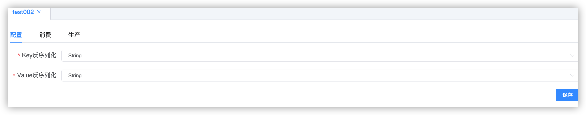
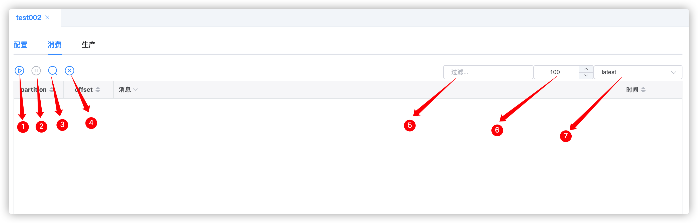
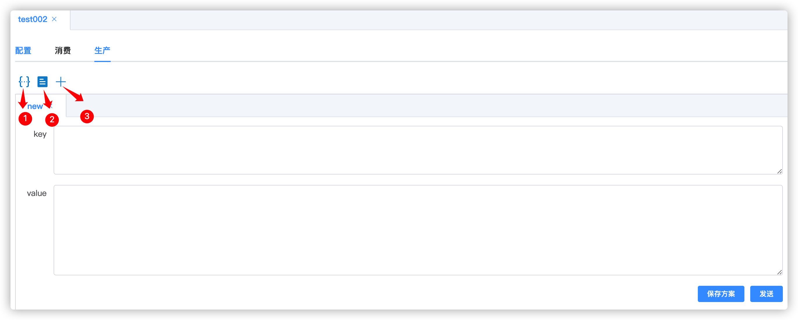

# 使用说明
### 设置
设置连接的Kafka的超时时间,设置默认的`topic`的反序列化方式

## 集群管理


点击图中标注位置,点击新增,并填写名称与地址,并点击[确定]


## 连接


点击图中下拉选,选择需要连接的集群,连接成功后,左侧出现树(包含:Node,Topic,Consumer),若地址填写错误,会出现`连接失败`提示


## Node

点击`Node`右侧`...`,可以查看节点信息 新增topic,填写名称,分片,副本数,点击确定即可


## Topics

- 点击右侧`...`,可以新增`topic`,`刷新`
- 点击具体某个`topic`右侧的`...`可以,删除`topic`,调整分片信息,查看分片信息,接收与发送数据
- 双击某个具体的`topic`,也可以接收与查看数据
### 数据接收与发送

此功能分为三个tab,分别为`配置`,`消费`,`生产`
- 配置: 可以配置消费消息时,数据的反序列化方式
- 消费: 可以查看消费的数据
  - 支持实时消费数据
  - 支持消费固定数量的数据
- 生产: 生产数据,目前只支持字符串格式,支持使用部分内置表达式,说明详见[表达式](#表达式)
### 配置
选择,key与value的反序列化方式

### 消费

标注说明

1. 启动实时消费
2. 停止实时消费
3. 单次查询固定数量的记录(每个partition均会消费[6]设置的条数)
4. 清除表格数据
5. 过滤
6. 设置`3`的消费数量,只对`3`有效
7. 消费位置`latest`只消费最新数据,`earliest`从最开始消费数据,只对`1`有效
### 生产
向该`topic`推送数据,可以设置表达式,可以将常用的消息保存为方案,方便后续使用

标注说明
1. 设置当前消息的表达式
2. 查看已经保存的方案
3. 新增一条新的消息

表达式使用方式

在`key`或者`value`中被`${}`包裹的内容为需要使用表达式解析的内容

例如,想推送如下消息
- 案例一
```
{"timestamp":当前时间毫秒数,"creator":"Lucy"}
```
可以设置表达式,也可以将表达式直接写到`key`,或者`value`中

设置value为
```
{"timestamp":${#date.timestamp()},"creator":"Lucy"}
```
接收到消息
```json
{
    "timestamp": 1632500506706,
    "creator": "Lucy"
}
```
- 案例二
```json
{"time":"当前时间+1天,格式:yyyy-MM-dd HH","creator": "Lucy","type": "类型"}
```
表达式如下

|键|表达式|说明|
|---|---|---|
|current|#date.current()|获取当前时间|
|after|#date.addDays(#current,1)|将当前时间+1天|
|afterString|#string.format(#after,‘yyyy-MM-dd HH’)|将`after`格式化为`yyyy-MM-dd hh`|
value 如下
```json
{"time":"${#afterString}","creator": "Lucy","type": "类型"}
```
点击发送,即可收到消息
```json
{
    "time": "2021-09-26 00",
    "creator": "Lucy",
    "type": "类型"
}
```
#### 表达式


|表达式|说明|返回类型|
|---|---|---|
|#date.timestamp()|当前时间的毫秒数|Long|
|#date.addMinutes(date,amount)|在`date`的基础上,增加或者减少`amount`分钟|Date|
|#date.addMinutes(amount)|在当前时间的基础上,增加或者减少`amount`分钟|Date|
|#date.addSeconds(date,amount)|在`date`的基础上,增加或者减少`amount`秒|Date|
|#date.addSeconds(amount)|在当前时间的基础上,增加或者减少`amount`秒|Date|
|#date.current()|当前时间|Date|
|#date.addDays(date,amount)|在`date`的基础上,增加或者减少`amount`天|Date|
|#date.addDays(amount)|在当前时间的基础上,增加或者减少`amount`天|Date|
|#string.format(date,pattern)|时间格式化,`date`:Date类型,`pattern`:格式|String|
|#string.uuid()|uuid|String|
|#string.formatDate(date)|某个date格式化为`yyyy-MM-dd`|String|
|#string.formatTime(date)|某个date格式化为`yyyy-MM-dd HH:mm:ss`|String|
|#string.yyyyMMddHHmmss()|获取当前时间,格式`yyyy-MM-dd HH:mm:ss`|String|
|#string.yyyyMMdd()|获取当前日期,格式`yyyy-MM-dd`|String|
|#string.hhmmss()|获取当前日期,格式`yHH:mm:ss`|String|
|#string.md5(content)|将content,进行md5加密|String|
## Consumer
系统内置的`Consumer`均为`visark-`开头,可以随意删除,若正常停止实时任务,会自动删除
- 点击某个`Consumer`右侧的`...`可以删除`Consumer`,若该`Consumer`正在使用,则会出现删除失败提示